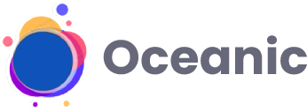

<h1 align="center">
  <a href="https://ocean-ds.github.io/ocean-web/index.html">
    
  </a>
</h1>

<p align="center">
 A Design System for creating UI with <a href="https://pt-br.reactjs.org/">ReactJS</a>
</p>

<p align="center">
  <a href="https://github.com/prettier/prettier">
    
  </a>
  <a href="https://github.com/prettier/prettier">
    
  </a>
  <a href="https://github.com/prettier/prettier">
    
  </a>
  <a href="https://github.com/prettier/prettier">
    
  </a><br />
  <a href="https://github.com/prettier/prettier">
    
  </a>
  <a href="https://github.com/prettier/prettier">
    
  </a>
  <a href="https://github.com/prettier/prettier">
    
  </a>
</p>

## Documentation

Documentation and examples can be found [here]().

## Install

```sh
$ yarn add oceanic-react-ui
```

## Contributing

Help us to improve this project by fixing bugs, suggesting improvements or simply helping us spread the word.

### Starting the project

Clone this repository and install its dependencies:

```sh
$ git clone https://github.com/fmm312/oceanic-react-ui
$ cd oceanic-react-ui
$ yarn
$ yarn start
```

### Code of conduct

A code of conduct sets standards for how to engage in a community. It signals an inclusive environment that respects all contributions. It also describes procedures for resolving issues among project community members. Read the [code of conduct]().

### Contributing guide.

These are guidelines for making contributions to this project. Read the [contributing guide]().

### Good practices of pull request

This is a pull request [template]() to the repository.

## Releases

To keep better organization of releases we follow the [Conventional Changelog](https://github.com/conventional-changelog/standard-version) guidelines. See [Releases]() for detailed changelog.

## License

[MIT License]()
